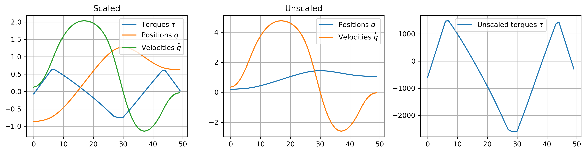
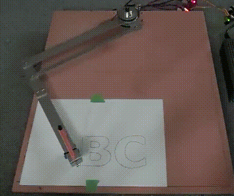
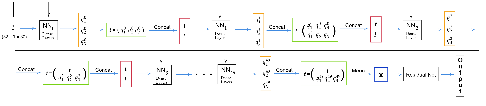
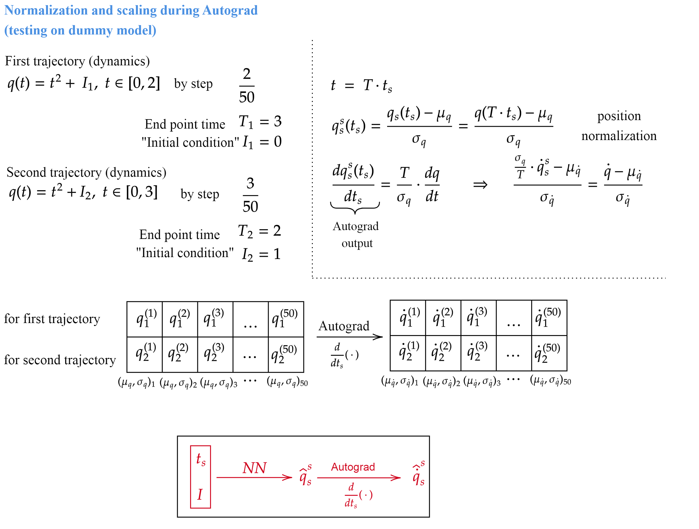
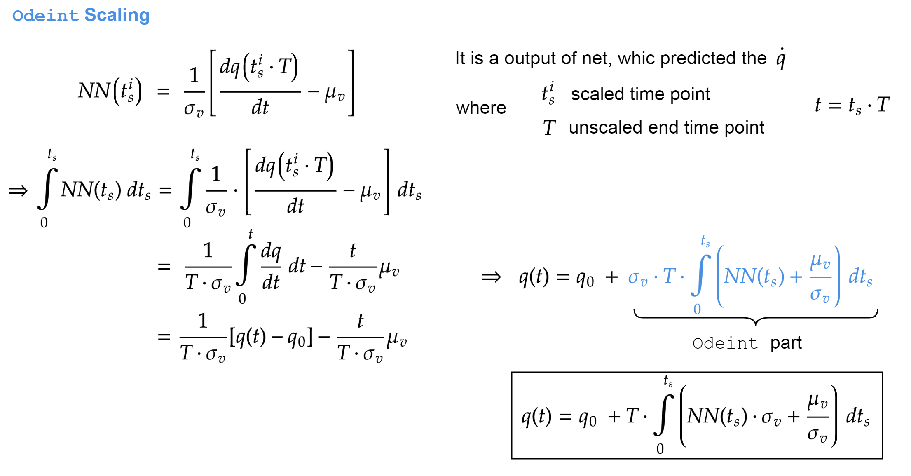
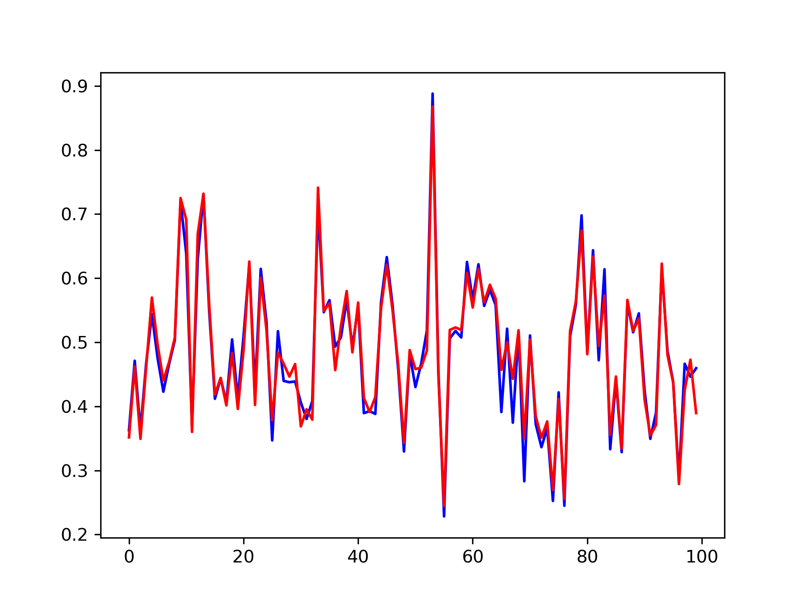
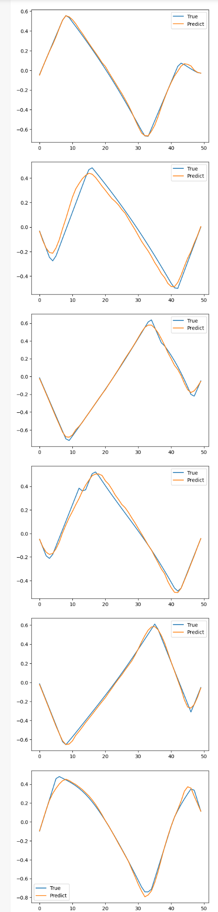
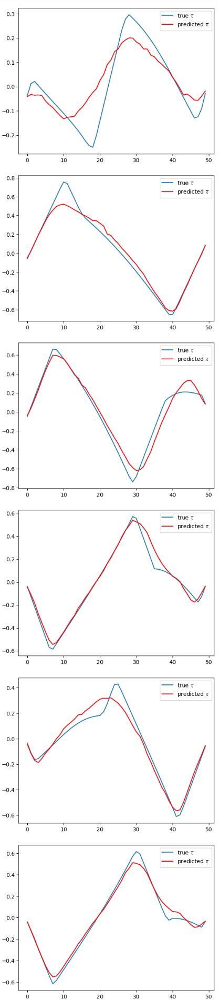
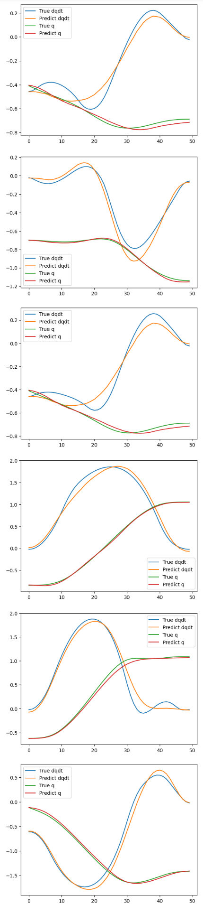

#  Robot Manipulator Optimal Dynamic

<p align="center">
  
</p>
Considering the task of robot manipulator motion optimal dynamics were found. 
The robot manipulator comprises two arms and a free end for cargo movement. 
The motion of the free end describing by two angels 

We need to find the optimal trajectory for a given pass point and end point 
### Dataset
We have approximately 70.000 different trajectories. Each trajectory consists 50 time points. The intervals between these points are equal to each other. 
For this time points are the following 
**positions/angels, velocities, torques, and initial conditions (which "parameterized" each trajectory)**. In addition for all trajectories pass point times are given:

<p align="center">
  
</p>

In addition there are two type of each quantity- *scaled* and *unscaled*.

Data path 
- *Positions*:

    Unscaled `/data/mat/unscaled_data/position0_train.mat`
    
    Scaled `data/mat/scaled_data/position0_train.mat`

- *Velocities*:

    Unscaled `/data/mat/unscaled_data/velocity0_train.mat`
    
    Scaled `/data/mat/scaled_data/velocity0_train.mat`

- *Torques*:

    Unscaled `/data/mat/unscaled_data/out_torque0_train.mat`
    
    Scaled `/data/mat/scaled_data/outandpred_torque0_train.mat`

- *Time*:

    Unscaled `/data/mat/unscaled_data/time_train.mat`
    
    Scaled `/data/mat/scaled_data/time_train.mat`
    
- *Initial Conditions*:
    
    Unscaled `/data/mat/unscaled_data/initial_conditions_train.mat`
    
    Scaled `/data/mat/scaled_data/initial_conditions_train.mat`


Example of the scaled and unscaled quantities (positions/velocities/torques):
<p align="center">
  
</p>


### ***ODE***

These quantities are connected together by the ordinary differential equation of the following form
<p align="center"> 
  
</p>
<p align="center">
  
</p>


Where A,B is the matrices and C is the vector, they also depended of the manipulator parameters: arm-s length, masses, and gravitational constant [[1]](#ref_1). This ODE describes the dynamics of the manipulator, but ODE (with the initial conditions) itself **doesn't determine** the optimal dynamic.

<p align="center">
  
</p>

### ***Optimal Control Problem*** 
As mentioned above, the optimal trajectory strightly doesn't determinated by ODE. The optimal trajectory with subject to constraints  determinated by the following optimization problem 
<p align="center">
  
</p>
where the Tpp and Tep are the pass point and end point time respectively. One part of the constraints come from the ODE and another part from the several physical conditions.

## **Approaches**

- Since the trajectories are parameterized by the initial conditions then the initial conditions may be used as a net-s input.

- For all quantities (positions/velocities/torques) each time point can be trained separately (i.e. no one points “see” the other) and improve the results using another net (for example combined by LSTM and Dense layers).

- Residual Net

     The following scheme demonstrated the Res-Net working principle for positions (it also applies for velocities and torques).
     
  
- Data (for positions/velocities/torques) can be enriched by using the splines. This can be realized by using the `torchcubicspline` package. 
 
## **Training**

### ***Pretraining step***
When positions and velocities are considered, then it is two possibilities. **Firstly**, we can predict the position and after that using the autograd `torch.grad` w.r.t time steps find the velocities. **Or vice versa** using the predicted velocities we can integrate the net, for example, via the `odeint()` of the *Torchdiffeq* package [[2]](#ref_2).

According to the differentiation or integration we using the following scaling/unscaling procedures 
- Scalings and normalization according to the differentiation:
    In the pretraining step for the positions and velocities made the following transformations (using the mean value and standard deviation)
<p align="center">
  
</p>


- Scaling and normalization according to the integrating:
    The scaling process according to the integrating is a litlie bit different form the scaling above:
<br>
<p align="center">
  
</p>

As can be seen from the expressions during scaling, in addition to mean values and standard deviations, we also need the predicted end point time. For these purposes used the pretrained network, which is trained only for end point time.
Time net prediction plot 
<p align="center">
  
</p>


it's accuracy (calculated by MSE Loss) is the **0.0005**. The time implementation is located `notebooks/model_archs/Time_Net.ipynb`


## **Best results**

### ***Net-s description***

In this section demonstrated the results which have been achieved using the following net-s:

- *Res-Net*
    
    This net described in the **Approaches** section scheme.
    
    From scaled initial conditions net predicts scaled torques for 50 time steps.

- *Separate-Net + LSTM*
    
    First step, using the scaled initial conditions trained each positions/velocities/torques separately for every 50 time point, i.e. according to the Separate-Net training no one points “see” the another point. After that pretrained quantities go through LSTM net which improve the previous step net results. For torques in final LSTM net also using the torques helpers.
    

### ***Results***
#### *Accuracy*
The losses computed by MSELoss

|Data | Torques (Res-Net) | Torques (Separate-Net + LSTM) | Positions and velocities |
|:-   |:-:   |:-:   |:-:  | 
|Full |0.0018|0.0018|0.0039|
|Test |0.0027|0.0031|0.0110| 
|Train|0.0017|0.0016|0.0037|

#### *Paths*
- **Torques (Res-Net) implementation**:  
    - Implementation is located `notebooks/model_archs/res_net_sequential_prediction_torque_best_result_test_and_train.ipynb`
    <!-- - Weights saved in `notebooks/model_archs/models/best_result_with_res_net.pt` -->
- **Torques (Separate-Net + LSTM)**:
    - Implementation is located `notebooks/model_archs/LSTM_Helpers_Res-net.ipynb`
    <!-- - Weights saved in `notebooks/model_archs/models/LSTM_HelpTorq_LossDiff.pt` -->
- **Positions and velocities**:
    - Implementation is located `notebooks/model_archs/Separate_nets_LSTM_dqdt_q.ipynb`
    <!-- - Weights saved in `notebooks/model_archs/models/dqdt_q_lstm.pt` -->

#### *Plots*
<center>

Torques (Res-Net)          | Torques (Separate-Net + LSTM) | Positions and velocities                                               
:-------------------------:|:-------------------------:    | :-------------------------:
   |  | 

</center>

## Citation
```
@article{
  title={High accuracy adaptive motion control for a robotic manipulator with model uncertainties based on multilayer neural network},
  authors={Hu, Jian, et al.},
  year={2022},
  doi={https://doi.org/10.3390/act11090255},
}
```

```
@article{
  title={Neural ordinary differential equations; Advances in neural information processing systems 31},
  authors={Chen, Ricky TQ, et al.},
  year={2018},
  doi={https://doi.org/10.48550/arXiv.1806.07366},
}
```
